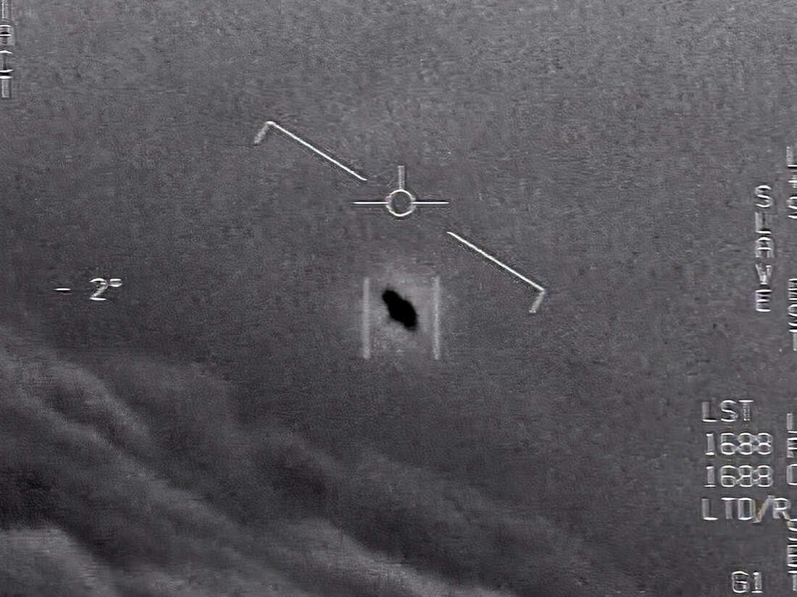

<!-- <section data-background-image="assets/images/Tokyo.jpg" data-background-opacity="0.2" data-state=header0> -->
<section ection data-background-image="assets/images/sunFlares.jpg" data-background-opacity="0.5" data-background-color="#FF6600" data-state=header0>
 
    <!-- <h1 style="color:white;">STARPUNK X FUTURE HUMANS</h1> -->
    
    <!-- <h3 style="color:white">A STELLAR ATLAS</h3> -->
</section>
<section data-state=header0>
    
    <h3>A STELLAR ATLAS</h3>
</section>
<section data-background-color="#05014a" data-state=header1>
    
    <blockquote>
        “We’re made of star stuff.  
We are a way for the cosmos to know itself.”
    </blockquote>
    <aside class="notes">
        A quote I find at same time profound and utterly arrogant. Setting up a certain worldview at the centre of the cosmos📝
    </aside>
</section>
<section data-state=header0>
    <h1>Future Humans — Life Otherwise</h1>
    <aside class="notes">
        Exploring uncharted narratives, Challenging the way we look at things and the way we understand them. 📝
    </aside>
</section>
<section data-background-color="black" data-state=header0>
    <!--  -->
    <iframe width="560" height="315" src="https://www.youtube.com/embed/zBAMTsXg2aQ?si=Ss6tHycQHyVlU33S&amp;controls=0" title="YouTube video player" frameborder="0" allow="accelerometer; autoplay; clipboard-write; encrypted-media; gyroscope; picture-in-picture; web-share" allowfullscreen></iframe>
</section>
<section data-state=mission>

    <!-- 
Disciplines

    
Departments

    
Institutions

    
People & Machines

    
Industries & Consumers

    
Individuals & Environment

    
Objects & Subjects
 -->
    <h1>An Atlas Of/for The Unknown</h1>
    <aside class="notes">
        Exploring uncharted narratives, Challenging the way we look at things and the way we understand them. 📝
    </aside>
</section>
<section data-state=headerTabu>
    
    
</section>

<section data-state=header3>
    
    
</section>

<section data-state=Moon>
    
    
</section>

<section data-state=Moon>
    
    
</section>
<section data-state=Moon>
    <!--  -->
    
</section>
<section data-state=Sun>
    
    
</section>
<section data-state=Moon>
    <!--  -->
    
</section>

<section data-state=mission>
<!--  -->
    Something about how we see aliens, in continuation of colonial stuff
    
</section>
<section data-state=header4>
    Something about the aims, and narrative structures
</section>
<section data-state=header4>
    Some output examples in 3D and stuff
</section>
