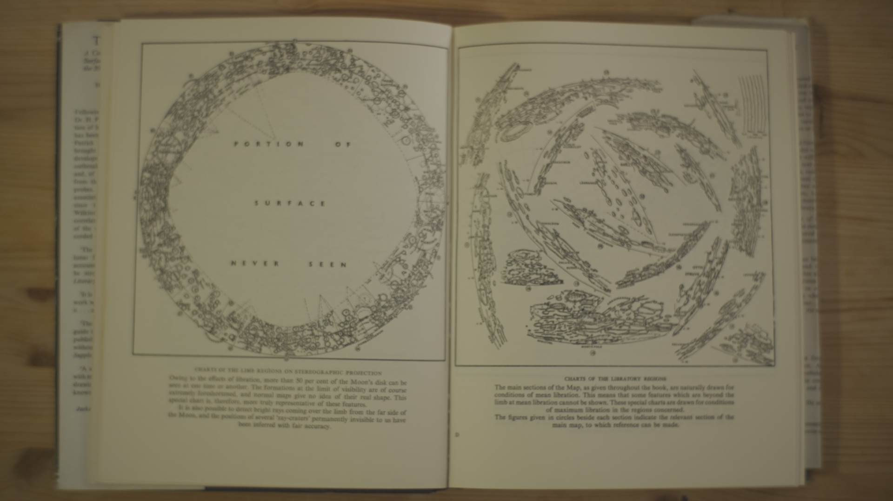
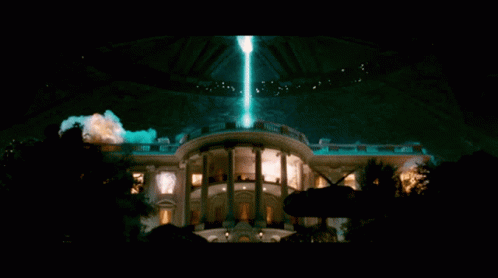

<!-- <section data-background-image="assets/images/Tokyo.jpg" data-background-opacity="0.2" data-state=header0> -->
<section ection data-background-image="assets/images/sunFlares.jpg" data-background-opacity="0.5" data-background-color="#FF6600" data-state=header0>
 
    <!-- <h1 style="color:white;">STARPUNK X FUTURE HUMANS</h1> -->
    
    <!-- <h3 style="color:white">A STELLAR ATLAS</h3> -->
</section>
<section data-state=header0>
    
    <h3>A STELLAR ATLAS</h3>
</section>
<section data-background-color="#05014a" data-state=header1>
    
    <blockquote>
        “We’re made of star stuff.  
We are a way for the cosmos to know itself.”
    </blockquote>
    <aside class="notes">
        A quote I find at same time profound and utterly arrogant. Setting up a certain worldview at the centre of the cosmos📝
    </aside>
</section>
<section data-state=header0>
    <h1>Future Humans — Life Otherwise</h1>
    <aside class="notes">
        Exploring uncharted narratives, Challenging the way we look at things and the way we understand them. 📝
    </aside>
</section>
<section data-background-color="black" data-state=header0>
    <!--  -->
    <iframe width="560" height="315" src="https://www.youtube.com/embed/zBAMTsXg2aQ?si=Ss6tHycQHyVlU33S&amp;controls=0" title="YouTube video player" frameborder="0" allow="accelerometer; autoplay; clipboard-write; encrypted-media; gyroscope; picture-in-picture; web-share" allowfullscreen></iframe>
</section>
<section data-state=mission>

    <!-- 
Disciplines

    
Departments

    
Institutions

    
People & Machines

    
Industries & Consumers

    
Individuals & Environment

    
Objects & Subjects
 -->
    <h1>An Atlas Of/for The Unknown</h1>
    <aside class="notes">
        Exploring uncharted narratives, Challenging the way we look at things and the way we understand them. 📝
    </aside>
</section>
<section data-state=headerTabu>
    
    
</section>

<section data-state=header3>
    
    
</section>

<section data-state=Moon data-background-color="black" data-background-image="assets/images/DSC02191.jpg">
    
    <!--  -->
</section>

<section data-state=Moon data-background-color="black" data-background-image="assets/images/DSC02187.jpg">
    <!--  -->
    <!--  -->
</section>
<section data-state=Moon data-background-color="black" data-background-image="assets/images/DSC02192.JPG">
    <!--  -->
    <!--  -->
</section>
<section data-state=Sun data-background-color="black" data-background-image="assets/images/DSC02200.jpg">
    
    <!--  -->
</section>
<section data-state=Sun data-background-color="black" data-background-image="assets/images/DSC02201.jpg">
    <!--  -->
    <!--  -->
</section>

<section data-state=mission data-background-color="black">
<!--  -->
    
    <aside class="notes">
        Challenge the way we entertain the idea of advanced extraterrestrial world, fitting within certain western idea of natural progress,
    </aside>
</section>
<section data-state=mission data-background-color="black">
<!--  -->
    
    <aside class="notes">
        fermi paradox, if they advanced they would go visit others, and they'd follow some extractive practice. In a way projecting our capitalist fears.
    </aside>
</section>
<section data-state=parker data-background-color="black" data-background-image="assets/images/sun.gif">

    <!--  -->
    <h3>Chapter I</h3>
    <h1>Observing the Amber Ember</h1>
    <aside class="notes">
        Aparatus
    </aside>
</section>
<section data-state=flare data-background-color="black" data-background-image="assets/images/sun_2.gif">

    <!--  -->
    <h3>Chapter II</h3>
    <h1>A Cosmic Conductor</h1>
    <aside class="notes">
        Solar weather
    </aside>
</section>
<section data-state=flare data-background-color="black" data-background-image="assets/images/flight404.jpg">

    <!--  -->
    <h3>Chapter III</h3>
    <h1>Mythologies & Histories</h1>
    <aside class="notes">
        histories
    </aside>
</section>
<section data-state=mission>
<!--  -->
    
AIMS:

    
 ✓ Investigate non-human-centric narratives and novel storytelling arcs and structures.

    
✓ Offer fresh perspectives that could influence the development and conceptualisation of a Starpunk narrative genre.

    
✓ Examine the potential for “Speculative Xenology†as an emerging bridge between astrobiology, speculative fiction, and anthropology.

    
✓ Establish a robust documentation and archival resource of narratives that can serve as a foundation for further development and iteration.

</section>
<section data-state=OUTPUT>

    
OUTPUTS:

    
✓ A cohesive and exhaustive series of articles, charts, diagrams, and illustrations, thoughtfully organised around thematic subjects, allowing for intellectual exploration of the Amber Ember as an environment, delving into its infrastructure and associated imaginaries.

    
✓ A well-defined strategy and approach for organising the content and executing the design of the atlas.

</section>
<section data-state=header4>
    Some output examples in 3D and stuff
</section>
