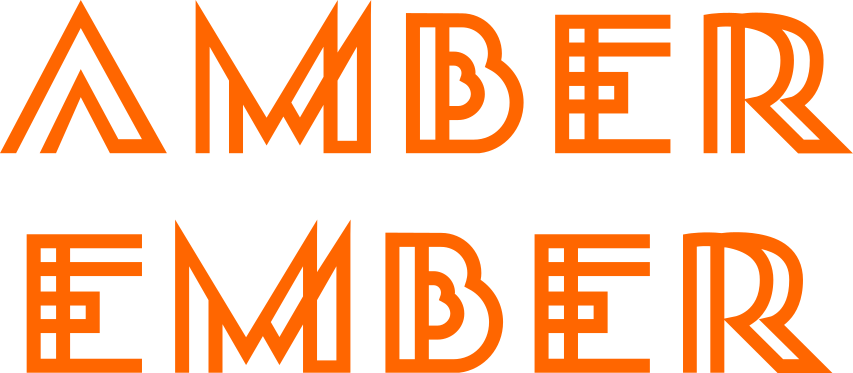

# A Stellar Atlas

---

> “We’re made of star stuff.  
We are a way for the cosmos to know itself.”

Carl Sagan — [Cosmos: A Personal Voyage, The Shores of the Cosmic Ocean, 1980](https://youtu.be/Nuez1HlBvqA?si=0P5XXLYB8_ESrNzU&t=129)

## BACKGROUND

_(Text partly styled by ChatGPT channelling its inner Carl Sagan)_

In the grand cosmic symphony, fascination arises with the Amber Ember, the luminous guiding star of an exceptional celestial family — a system graced with a total of nine celestial companions. Among these, seven planets and a solitary moon host life's vibrant dance, while two enigmatic worlds remain untouched, bearing the secrets of the cosmos.

Much like its celestial cousin, 61 Cygni A, the Amber Ember belongs to the K5V family, a classification that unveils its celestial quirks and echoes of familiarity with our Sun, the illustrious G2V star. In the lexicon of stars, "K5" marks the Amber Ember as cooler, dimmer, and more modest in size than our Sun. But the "V" appended to its stellar identity signifies its residence on the Main Sequence of its evolutionary stage, mirroring our Sun's steady, enduring dance of stellar existence.

With an astonishing lifespan of around 30 billion years — three times the Sun's own — the Amber Ember beckons us toward an era of extended evolution, innovation, and divergence from the well-trodden cosmic path of our Solar System.

This atlas serves as our interstellar guide, inviting us to embark on an expedition through the celestial tapestry of the Amber Ember, where science and wonder converge to unfurl the cosmic narrative of a star and its influence on its enthralling planetary companions.

This project is a collaborative effort with the Berggruen Institute's "Future Humans" group, under the leadership of Claire Isabel Webb, within the framework of _Life, Otherwise_. The Berggruen Institute is a think tank with bases in Los Angeles, Venice, and Beijing that is developing ideas for a changing world. 

_Life, Otherwise_ is an experimental project that delves into the assumptions surrounding the concept of life in an astrobiological context. It involves the collaboration of scientists and philosophers, jointly engaged in modelling an exosolar system, exploring speculative histories, hypothetical life forms, and cosmological events. Each scientist and design team is imagining a different planet. Our goal is to understand the star around which those planets rotate and the stories that might inform our understanding of this star through modelling, analyses, and the aparati of observation. 

While various teams and partners are dedicated to investigating each planet within the system, our specific contribution revolves around the development of this star through the stellar atlas. The ultimate goal of this project is to blur the boundaries that conventionally separate planetary science and astrobiology. In this way our mission is literally central to understanding the whole system that is being modelled, designed, and explored.

## MISSION

Your task is to embark on a captivating journey, one that will narrate the cosmic tales of a K5V star, the Amber Ember. Think of it as crafting an atlas that breathes life into this celestial character. Within its pages, you'll employ precise maps, diagrams, illustrations, articles, and so on, to weave a narrative as rich and profound as the universe itself.

As we delve into the existence of the Amber Ember, we're not merely telling a story; we're revealing an entire universe. Your exploration will extend far beyond the star itself. You'll unravel the intricate tapestry of the Amber Ember's environment, context, and the technological marvels that make its observation possible. From the telescopes designed to capture its radiant light to the mesmerising images generated and the meticulous analysis that deciphers their cosmic secrets, every facet of this stellar existence is yours to explore.

Let your imagination soar, for this is no ordinary task. It's a voyage into the realms of speculative and ontological realism, a venture that invites you to push the boundaries of what's possible, exploring a world beyond human conceptual framework, a world beyond human thought and experience. We aim not only to tell stories but to shift perspectives in the most imaginative ways. Here again, science meets the sublime, in an odyssey where the stars themselves are your storytellers.

### What's an Atlas?

The term "atlas" in this context refers to a multidimensional narrative project that combines scientific exploration, creative storytelling, and speculative imagination to unveil the life and character of a celestial entity. It incorporates a diverse range of elements such as maps, charts, diagrams, articles, and other creative and visual expressions, transcending the conventional boundaries of scientific reporting. Atlases are designed to provide comprehensive geographical, historical, or thematic information about a particular subject or area. Atlases are valuable tools for reference, education, and exploration, offering a visual and often detailed perspective on the subject matter they depict.

This atlas serves as a conduit for shifting perspectives, encouraging a profound exploration of the cosmos. Its purpose is to inspire readers to embrace a holistic understanding of the universe, one that fosters wonder, curiosity, and imaginative thinking beyond the confines of traditional scientific discourse.

### Relevant atlas references (potentially)

1. [Atlas of Remote Islands](https://www.google.co.uk/books/edition/Atlas_of_Remote_Islands/-FBERAAACAAJ?hl=en): Fifty Islands I Have Never Set Foot On and Never Will, by Judith Schalansky, 2009 \[[wikipedia](https://en.wikipedia.org/wiki/Atlas_of_Remote_Islands)\]

    This atlas presents an unconventional perspective, offering an alternative knowledge and understanding of the world. Integrating text and illustrations, it introduces cartographic representations featuring some of the world's most secluded and distant islands. While it does not provide precise geographical coordinates, it instead imparts a profound sense of geographical context, historical import, and geographical isolation. It underscores the artistic and narrative dimensions of cartography. Within its pages, each island is accompanied by a composite narrative, merging factual data, historical anecdotes, and the author's reflective insights.
2. [Codex Mendoza](https://en.wikipedia.org/wiki/Codex_Mendoza), ~1541

    The Codex Mendoza is a colonial-era manuscript originating from Mexico. Comprising pictorial illustrations and accompanying hieroglyphic text, it serves as an historical document, capturing the tribute system, governance, and social organisation of the Aztec Empire, offering rich insights into the civilization that once thrived in the heart of Mexico. Commissioned by Antonio de Mendoza, the first Viceroy of New Spain, It was designed to serve as a comprehensive exploration of Aztec culture on behalf of the Spanish crown, undoubtedly wielded as a [political instrument in the spanish conquest of the Aztecs](https://english.elpais.com/culture/2022-10-16/the-codex-mendoza-was-used-to-legitimize-spanish-conquest-of-the-aztecs.html).
3. [An Atlas of the Difficult World](https://archive.org/details/atlasofdifficult00rich) by [Adrienne Rich](https://en.wikipedia.org/wiki/Adrienne_Rich), 1991

    Although not a conventional atlas, it takes on the essence of an atlas through poetic exploration and thematic organisation. Rich's collection of poems acts as a metaphorical atlas, where each poem serves as a map to navigate complex emotional, political, and societal landscapes. These maps guide readers through intricate terrains of identity, gender, politics, and society, offering unique perspectives on the challenging aspects of our world. In essence, "An Atlas of Difficult Words" is an atlas of poetic knowledge, where words and imagery are used to map the complex and multifaceted landscapes of human existence and social consciousness.
4. [Codex Seraphinianus](https://www.holybooks.com/wp-content/uploads/CodexSeraphinianus.pdf) by Luigi Serafini, 1981 \[[wikipedia](https://en.wikipedia.org/wiki/Codex_Seraphinianus)\]

    While not strictly an atlas, the "Codex Seraphinianus" is a highly relevant and imaginative work for the purpose of world-building. This surreal and enigmatic creation by Luigi Serafini defies easy categorisation. It is an intricate journey into a fantastical realm that combines elements of an encyclopaedia, an art book, and a linguistic experiment. Within its pages, readers encounter a vividly illustrated and cryptic world filled with bizarre flora, fauna, and landscapes, all accompanied by an invented script that challenges linguistic conventions.

## TABLE OF CONTENT

As the curators of this atlas and the architects of its content, your role is pivotal in addressing three distinct yet interrelated categories — although presented as chapters here, the hierarchical organisation of your atlas does not need to follow the structure below:

### Chapter I — Observing the Amber Ember

Here, we embark on a profound exploration of the myriad technologies that empower inhabitants of the system to peer into the enigmatic depths of the Amber Ember's cosmic realm. This is a realm of discovery and innovation, where the tools and techniques employed to monitor and survey this celestial entity's dynamic activity are unveiled. Yet, this domain transcends the realm of the known, as it beckons the imagination to venture into the uncharted territories of speculation. Amidst the astronomical marvels, one may ponder the audacious concept of megastructures, as briefly hinted at in our introduction. And yet, this is only the threshold of the imagination, for beyond it lies a universe of speculation, where [concepts](https://en.wikipedia.org/wiki/Stellar_engine) like [stellar engines](https://youtu.be/v3y8AIEX_dU?si=zY59QE0M1KoWye_v) beckon to be explored.

### Chapter II — A Cosmic Conductor

In this chapter, the Amber Ember assumes the role of a celestial maestro, orchestrating a symphony of cosmic phenomena within its domain. Stellar flares and [prominences](https://en.wikipedia.org/wiki/Solar_prominence), born from the crucible of solar storms, take centre stage. These eruptions, capable of igniting geomagnetic storms reminiscent of events like the historic [Carrington event](https://en.wikipedia.org/wiki/Carrington_Event) — [a solar storm of extreme magnitude](https://arstechnica.com/science/2012/05/1859s-great-auroral-stormthe-week-the-sun-touched-the-earth/) —, are narrated in vivid detail. Through the artistry of illustrations and the precision of diagrams, the dance of gravitational forces is unveiled. Here, the very forces that shape our cosmic ballet become tools to capture the imagination. Additionally, we delve into the radiant energies the Amber Ember bestows upon the universe, contemplating the nature of its visible light, the intensity of its heat, and the mysterious hues of its diverse radiation.

### Chapter III — Mythologies & Histories

In this realm of storytelling and cultural significance, we cast our gaze upon the Amber Ember's potential to become the cornerstone of folklore for the inhabitants of its stellar realm. Myths take root, intertwining with the star's hinted inner intelligence, akin to the fabled [cosmic necklaces](#more-interesting-things-to-consider). Within this mythic landscape, tales emerge, recounting encounters with enigmatic alien technologies, and the whispered presence of satellites and probes, — such as the illustrious [NASA's Parker Solar Probe](https://www.nasa.gov/feature/goddard/2021/nasa-enters-the-solar-atmosphere-for-the-first-time-bringing-new-discoveries). Yet, the inquiry delves deeper; it explores the intricacies of these interactions and ponders how such ethereal encounters can be measured, represented, and immortalised in the annals of this cosmic chronicle.

## OUTPUTS

- A cohesive and exhaustive series of articles, charts, diagrams, and illustrations, thoughtfully organised around thematic subjects, allowing for intellectual exploration of the Amber Ember as an environment, delving into its infrastructure and associated imaginaries.
- A well-defined strategy and approach for organising the content and executing the design of the atlas.
- Assets designed for this atlas should be crafted and executed with the flexibility to seamlessly integrate into an online publication.

While we do not require full completion, we seek more than just a prototype; we aim for a finely crafted narrative system that captivates people's imagination.

## AUDIENCE

Our audience encompasses a diverse spectrum of individuals. While certain aspects can be viewed from the perspective of public engagement and outreach, this project also aims to engage researchers both within and outside the Berggruen Institute, including the participating scientists and researchers, along with the broader community of astrobiologists and planetary researchers that Life Otherwise seeks to involve in conversations. 

The field of science, particularly when exploring and defining life beyond our planet, is not monolithic; rather, it is filled with subjectivities, influenced and moulded by beliefs and worldviews.

Your aim is to engage in the exploration of fresh conceptual frameworks pertaining to the imagination, anticipation and perception of extraterrestrial worlds.

In doing so, the goal is to promote a more holistic examination of the mechanisms that facilitate the emergence of life. Instead of adhering to the confines of individual planets and isolated potential biosignatures, we might contemplate exosolar systems as a collective, intergalactic ecosystem essential for nurturing life. This approach could even lead, potentially, to a reevaluation of our understanding of life itself.

## METHODS

This project centres on content generation, editing, exploration, and narrative experimentation. Consequently, consider leveraging tools like ChatGPT and other generative AI-based media, alongside visualisation tools, diagrams, simulators, virtual environments, video essays, found footage and any other suitable means to effectively convey your message. Additionally, feel free to devise your own techniques for coherent organisation and strategic storytelling to effectively communicate your objectives.

Delve into the world of contemporary cartography and mapping within modern contexts. Seek inspiration from unconventional sources, blend diverse aesthetics, and forge a distinctive design vernacular.

## AIMS

- Investigate non-human-centric narratives and novel storytelling arcs and structures.
- Offer fresh perspectives that could influence the development and conceptualisation of a Starpunk narrative genre.
- Examine the potential for “Speculative Xenology” as an emerging bridge between astrobiology, speculative fiction, and anthropology.
- Establish a robust documentation and archival resource of narratives that can serve as a foundation for further development and iteration.

## FURTHER INFORMATION ABOUT K5V STARS

### Habitability

At the heart of this cosmic ballet lies the concept of the "Habitable Zone," a region where life might find the conditions it needs to thrive. Interestingly, this zone is nestled closer to our star.

The proximity of a planet to its star plays a crucial role in this cosmic equation. The closer a planet is, the dimmer it appears from afar, creating a stark contrast that aids us in spotting these distant worlds. With this contrast, we can begin to decipher the secrets of potential biospheres.

However, in this stellar narrative, we encounter some intriguing twists. Stars on the cooler, dimmer end of the stellar spectrum, known as [M dwarfs](https://en.wikipedia.org/wiki/Red_dwarf), have fiery tempers. They frequently unleash [flares](https://en.wikipedia.org/wiki/Solar_flare), [coronal mass ejections]9(https://en.wikipedia.org/wiki/Coronal_mass_ejection), and other tantrums that can disrupt the stability of their planetary companions. Such tumultuous events make it challenging for life to establish itself, stripping away atmospheres and confining existence to isolated pockets.

Now, consider the K dwarfs, a stellar class that strikes a balance in this cosmic symphony. Less numerous than M dwarfs but offering a middle ground between our Sun and the fiery M dwarfs, they hold the potential for habitable conditions. They are dimmer than our Sun yet less turbulent than their M dwarf counterparts.

Yet, the story doesn't end there. Stellar evolution introduces another layer of complexity. Some planets don't initially reside in the Habitable Zone; they migrate there later in their cosmic journey. These "belatedly habitable" worlds raise intriguing questions about the timing of life in the cosmos.

### More interesting things to consider

In the cosmic tableau we envisage, there dwell civilizations far more advanced than our own. To sustain their towering edifices of technology, one can surmise that their hunger for energy surpasses our own humble needs. And in the intricate ballet of a planetary system, the brightest jewel in the firmament, the host star, beckons as the ultimate energy source. But how, you might wonder, did they harness this cosmic wellspring?

One tantalising concept that has stirred the imagination of scientists and dreamers alike is the notion of megastructures, perhaps akin to what visionary physicist Freeman Dyson envisioned — the [Dyson sphere](https://en.wikipedia.org/wiki/Dyson_sphere). These colossal constructs would encircle their parent stars, capturing every whisper of starlight to power the boundless ambitions of a civilization.
But let's not constrain our imagination there. What other wonders might we conjure? How would such constructs manifest? Would they cloak the star in a cosmic cocoon, altering its radiance and casting unique shadows upon neighbouring worlds? And what ripple would this profound transformation cast upon the quest for life?

Now, let us wander down a most speculative avenue — the prospect of life, or rather, intelligence within stars themselves. A daring notion indeed! There's a hypothesis that speaks of cosmic necklaces composed of magnetic monopoles and superconducting strings. These cosmic adornments, born in the cosmic dawn, might harbor information much as DNA encodes the essence of life. Could this signal the potential for life within the very heart of stars?

A word of caution, though, for this is the realm of the speculative. Magnetic monopoles, elusive entities that they are, remain undiscovered, and our fundamental laws of electromagnetism discourage their existence. The leap from “capable of encoding information” to “hosting sentient life” is a profound one, with many mysteries between. However, there's room for exploration without conferring sentience to star-life.

Consider the sensorial realm of these hypothetical star-dwellers. How do they perceive their fiery abode? What stimuli guide their existence, and how do they decipher these cosmic messages? Can we, in our humble humanity, ever fathom their sensorial universe?

Another path invites us to envision these lifeforms visually. DNA, our biological blueprint, boasts the iconic double-helix structure. But what of these cosmic necklaces? What novel architectures might arise from their cosmic dance? How do these structures encode the tapestry of information? What visual marvels might emerge from these superstructures of cosmic adornments?

And as we ponder the cosmic symphony, we mustn't forget the intricate dance of exoplanets and their parent stars. Tidal forces sculpt their destinies, driving orbits ever closer until planets may even find themselves devoured by their stellar benefactors.
In this grand cosmic narrative, we venture where science meets the sublime, where the speculative dances with the bounds of possibility. It's a realm where imagination knows no bounds, and where each question unlocks a new universe of wonder.

### Relevance

In our never-ending search for life beyond our blue planet, a cadre of scientists, often referred to as astrobiologists, has long been on a quest. They sought what we might call a “smoking gun” in the atmospheres of distant worlds — the proverbial biosignature gas. Oxygen, for instance, has been a tantalising prospect. Sometimes, we cast our gaze even further, scrutinising the broader context of these alien realms. Does liquid water flow there? What vistas await on their surfaces? And what secrets does their atmosphere hold? These are the riddles that have fueled our cosmic curiosity.

But, here's the revelation that's slowly emerging from the cosmic tapestry — life isn't an isolated entity, but a complex system-level phenomenon. Its birth, its evolution, and perhaps most intriguingly, its detectability are inextricably woven into the intricate interplay between a planet and its nurturing star. This realisation becomes especially profound when we set our sights on two distinct avenues of exploration:

- Firstly, we ponder the nature of the star's radiation. Does it flood its planetary companion with blistering ultraviolet rays? Or does a gentler spectrum, dominated by optical and infrared light, hold sway? Equally crucial is the star's demeanour over the aeons. Does it maintain a serene cosmic composure or erupt in tempestuous outbursts over geological ages? These celestial factors wield profound influence, not only on the planetary theatre but on the very emergence of life itself.
- Secondly, we delve into the critical role that stellar radiation plays in our astrobiological methods. At present, our primary approach involves the transit method — a cosmic minuet where we observe the star's light filtering through the delicate veil of an orbiting planet's atmosphere. Yet, disentangling the subtle melodies arising from the planet's atmosphere from the harmonies introduced by "stellar contamination" is akin to deciphering a cosmic symphony.

In our unyielding quest for understanding, we strive to recreate the cosmic melodies of the planets within our celestial neighbourhood. We recognize that the star's radiance isn't just incidental but the very essence of the breathtaking vistas that these alien worlds present. Rather than reducing our discourse to binary labels of habitable or inhabited planets, we propose a broader vista. We implore our fellow astrobiologists to embrace the exquisite interplay between planet and star, to acknowledge the enduring significance of these celestial partnerships that span cosmic epochs. In doing so, we aim to blur the lines that have traditionally demarcated planetary scientists from their stellar astrophysicist brethren.

Our mission is resolute: as we embark on narratives that orbit the radiant hosts of cosmic systems, we seek to inspire — or rekindle — the inclusion of stars in our very concept of habitability. We champion the idea that the search for life is not confined to planets alone, but encompasses the cosmic dance between star and planet.

## TIMELINE

Each week is punctuated by a Review/Presentation. They provide valuable feedback and guidance on your ongoing work. It's essential to come prepared for these meetings to ensure productive use of time. Following each meeting, we set weekly objectives categorised as A's and B's, as outlined in the table below.

- **A's** tend involve reflective tasks, where you'll analyse your progress, make sense of feedback received, and strategise how to move forward effectively.
- **B's** tend to focus on specific deliverables required for the upcoming review or meeting. These tasks are designed to keep our workflow efficient and goal-oriented.

You can do more than what is suggested in the **A’s** and **B’s**, but no less, and should aim to meet at least those minimum expectations.

During the project, we will engage in partner calls with Claire Webb. These sessions will serve as occasions to assess our progress, gather information, and collect valuable, constructive feedback.

| wk# | Date | Stages | Objectives |
| --- | --- | --- | --------- |
|I|18/10|Launch| ***A. Initial scoping:*** Shaping your understanding   ***A.1.*** Mapping information related to the subject → Anecdotal stories, Speculative Technologies, Research Papers, Cultural tropes, etc. (e.g. quadrant model diagramming, mind mapping, future cones, the stack, …)   ***A.2.*** Investigate precedents and genealogy → Atlas as socio-political instrument, as metaphor, as recorded histories, etc.   ***A.3.*** Shaping your approach/position → A synthesis of **A.1. + A.2.**|
|I|||***B. Initial ideation:*** Shaping your direction   ***B.1.*** Framing/linking big ideas → Grouping/Clustering the research, highlighting overlaps and gaps   ***B.2.*** Quick fire labelling/titling → Give Names, Isolate Themes, Build the Project’s Lexicon|
|I|18/10|Partner Call|16:00-17:00 on Teams, ***Introductory chat***|
|II|25/10|Research|***A. The Big Edit:*** Exploring themes  ***A.1.*** Quick analysis → What’s interesting and why?  ***A.2.*** Choose weird ideas with the most potential → New Aesthetics, Unusual narrative structures, Subversive in good and bad ways|
|II|||***B. Quick Sketching:*** Re-Explore what you thought you knew   ***B.1.*** Think with your “HANDS” → Start sketching, 3D modelling, Writing, Prompting ChatGPT, Singing, Dancing, Laughing the research.   ***B.2.*** Reframing → Reevaluate/Re-Clustering the research, Give New Names/Labels   ***B.3.*** Final Edit → Choose the 2 ideas with the most content |
|III|1/11|Concept|***A. Final Scope:*** Delving Deeper  ***A.1.*** Choose a single direction → Most Inspiring, Most Memorable  ***A.2.*** Set Up Parameters → Exhaustive list of what needs to be done/developed in order to meet the deliverables|
|III|||***B. Make Things***    ***B.1.*** Develop Sketches into prototypes → Refine drawings, visuals, texts, and so on. Outline what their final outcomes should be.|
|III|1/11|Partner Call|16:30-17:00 on Teams, ***Mid project review***|
|IV|8/11|Prototyping|***A. Final Edit:*** Edit and Arrange   ***A.1.*** Planning → Make a thorough plan of what needs to be done when   ***A.2.*** Sourcing → Map out the resources needed (e.g. Rendering/Printing time, Technician help/advice, workshops, materials, …)|
|IV|||***B. The Plan in Action:*** Get On with It!!   ***B.1.*** Optimise → Weigh in on what is worth making for real, and what is worth simulating|
|V|15/11|Communication|***A. Sequencing***  ***A.1.*** Presenting → Narrate your narrative, Start with the big idea, delve into exciting the details|
|V|||***B. Visualising/Documenting***   ***B.1.*** Documentation → Turn ideas, process, designed objects into media worth sharing.   ***B.2.*** Script Writing → Come prepared, Know what you have to say when you have to say it, Rehearse!|
|VI|22/11|Presentation|***Bring it on!***|
|VI|22/11|Partner Call|16:00-16:30 on Teams, ***Final Presentation***|

---

> # ANNEX 
> 
> ## references
>
> - [Launch presentation](KICKOFF.md)
> - Bisson T., [They’re Made out of Meat](https://www.mit.edu/people/dpolicar/writing/prose/text/thinkingMeat.html), Omni Magazine, 1991 → [Radio play](https://www.bbc.co.uk/sounds/play/p00yyz3b)
> - Popper J., [Fragmenting a Monolith: Exploring and Disrupting an outer space imaginary](https://phaidra.kunstuni-linz.at/open/o:2792), 2021 → [Abstract](https://josephpopper.net/Fragmenting-a-Monolith)
> - Anderson R., et al., [Speculative Anthropologies](https://culanth.org/fieldsights/series/speculative-anthropologies), Society for cultural anthropology, 2018
> - [Hawaii Space Exploration and Analog Simulation](https://www.hi-seas.org/about-hi-seas)
>
>
