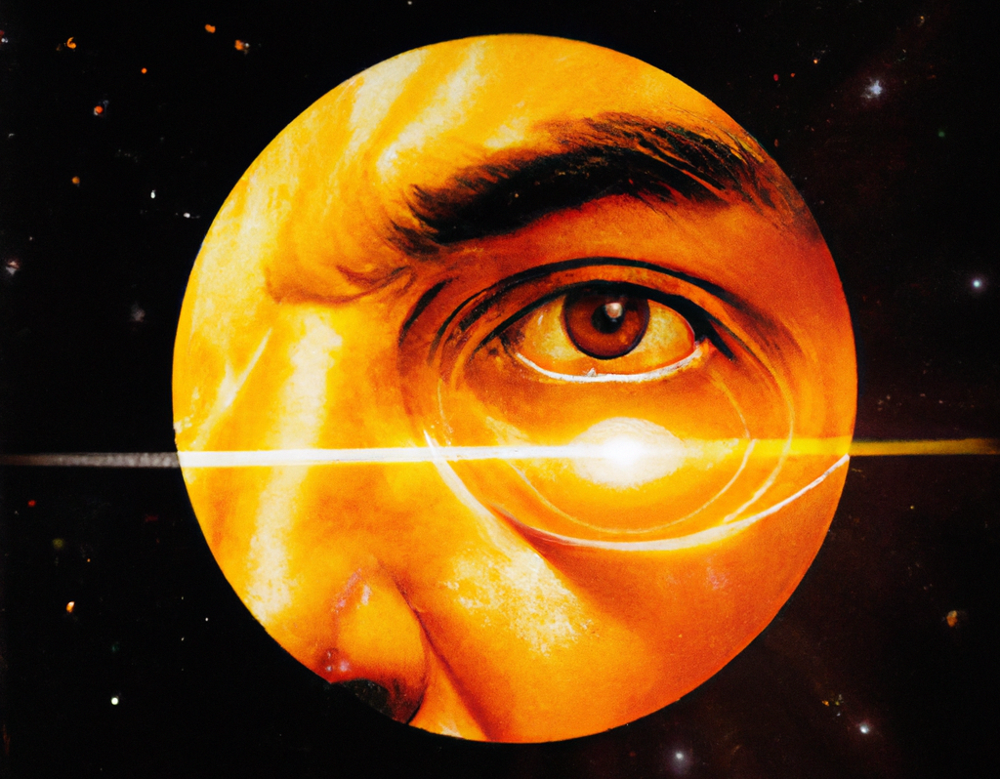

# A Stellar Atlas

> “We’re made of star stuff.  
We are a way for the cosmos to know itself.”

Carl Sagan — [Cosmos: A Personal Voyage, The Shores of the Cosmic Ocean, 1980](https://youtu.be/Nuez1HlBvqA?si=0P5XXLYB8_ESrNzU&t=129)

